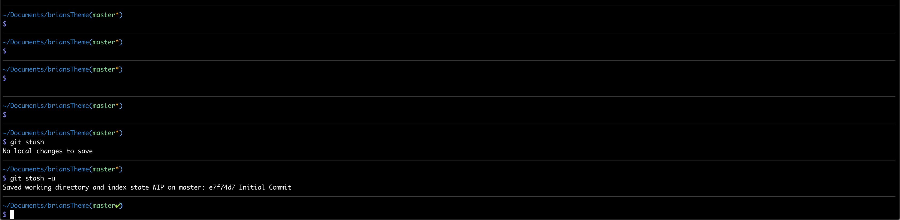
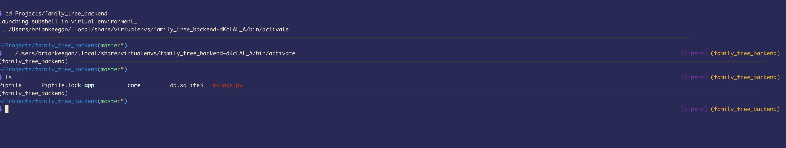

# About this Theme

This is customized from `af-magic`.
Basically the same thing with a few tweaks to look the way UI wanted it to.

Make sure [oh-my-zsh](https://ohmyz.sh/) is installed... and if it is...

copy the `brians-magic.zsh-theme` into `~/.oh-my-zsh/custom/themes`

open `~/.zshrc`
change `ZSH_THEME` to `brians-magic`

save and close file...

run `. ~/.zshrc`

(extra credit, delete this repo)

##### Stashed vs unstashed changes:

##### shows when using pip

